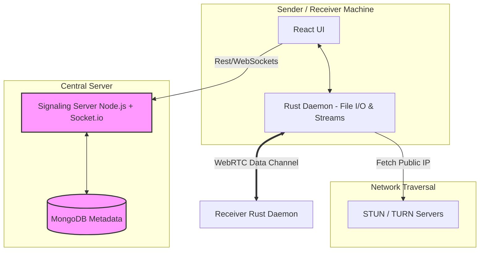
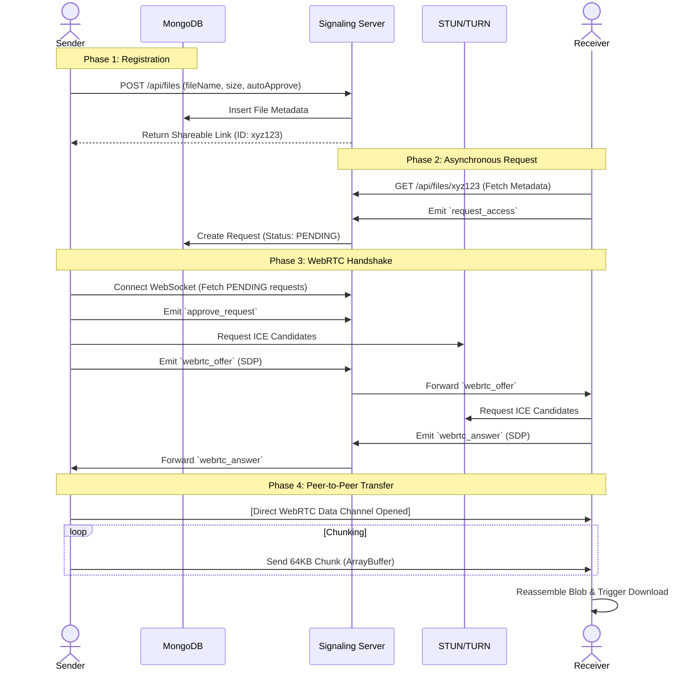

Bismillah.

Here is the complete, end-to-end architectural document for the P2P File-Sharing System. This markdown file covers everything from the High-Level Design (HLD) down to the Low-Level Design (LLD), incorporating the asynchronous request queue and performance optimizations.

You can directly copy this into a `README.md` or a system design documentation file.

---

# System Design Document: Asynchronous P2P File Sharing Platform

## 1. Project Overview

This project is a high-performance, asynchronous peer-to-peer (P2P) file-sharing platform. It allows users to generate shareable links for local files and transfer them directly to receivers over the network using WebRTC.

Unlike traditional file-sharing services (e.g., Google Drive, WeTransfer), this system **does not store the file on a centralized cloud**. Instead, it uses a central server only for signaling and request queuing. The actual data transfer happens directly between the Sender's and Receiver's machines.

### 1.1 Core Problems Solved

* **Privacy & Cost:** Files are not hosted on third-party servers. No storage costs, no data mining.
* **Size Limits:** Bypasses the 2GB/5GB artificial limits of cloud providers. You can send a 100GB file as long as the connection holds.
* **The "Offline" Problem:** Traditional P2P requires both users to be online simultaneously. This system introduces an **Asynchronous Request Queue** so receivers can request access while the sender is offline, and the transfer begins when the sender reconnects.

---

## 2. High-Level Design (HLD)

The architecture is strictly decoupled into two distinct planes: the **Signaling/Control Plane** and the **Data Plane**.

### 2.1 Component Architecture

1. **Local Client (The App):** A hybrid application consisting of:
   * **Frontend (React):** Manages the UI, generates links, and displays transfer progress.
   * **Local Daemon (Rust + Tokio):** A high-performance background process handling file system I/O, generating file hashes, and managing the WebRTC data channels. Using an async runtime ensures low memory overhead even when streaming multiple large files concurrently.

2. **Signaling Server (Node.js + Express + Socket.io):** The traffic cop. It handles user authentication, link generation, and routing WebRTC handshake messages (Offer/Answer/ICE). **It never touches the file data.**
3. **Database (MongoDB):** Stores the meta-state of the system (Users, File Metadata, and Pending Requests).
4. **NAT Traversal Infrastructure (STUN/TURN):** Essential servers that allow peers behind restrictive firewalls/routers to discover their public IP addresses and establish a direct connection.

### 2.2 System Architecture Diagram

---

## 3. Low-Level Design (LLD)

### 3.1 Database Schema (MongoDB)

The server needs to maintain the state of files and access requests.

**1. `Users` Collection**
Tracks active socket connections.

* `_id`: ObjectId
* `userId`: String (Auth ID or Guest ID)
* `socketId`: String (Current WebSocket session ID)
* `isOnline`: Boolean
* `lastSeen`: Timestamp

**2. `Files` Collection**
Stores metadata about the file being shared.

* `_id`: ObjectId
* `fileId`: String (Unique hash for the shareable link)
* `senderId`: String (Reference to User)
* `fileName`: String
* `sizeBytes`: Number
* `autoApprove`: Boolean (If true, bypasses manual sender approval)

**3. `Requests` Collection (The Mailbox)**
The core of the asynchronous feature.

* `_id`: ObjectId
* `fileId`: String (Reference to File)
* `receiverId`: String (Reference to User asking for the file)
* `status`: Enum `['PENDING', 'APPROVED', 'REJECTED', 'COMPLETED']`
* `createdAt`: Timestamp

---

### 3.2 The Asynchronous Workflow (Sequence Flow)

This is the exact sequence of events from link creation to file download.

---

### 3.3 Network & Transfer Optimization

To make this system robust enough for production and large file sizes, specific low-level mechanics must be implemented.

#### 1. File Chunking & Memory Management

Reading a 5GB video file into RAM will crash the Sender's machine. The Rust daemon must use streaming I/O.

* **Implementation:** Read the file in chunks of `64KB` (the optimal size for WebRTC Data Channels).
* **Flow:** Read 64KB -> Send over WebRTC -> Read next 64KB. This keeps memory usage near zero regardless of file size.

#### 2. Backpressure Handling

If the Sender's local network upload speed is 100 Mbps, but the Receiver is on a mobile network downloading at 5 Mbps, the Sender will flood the WebRTC buffer, causing the connection to crash.

* **Implementation:** The Sender must monitor the WebRTC `bufferedAmount`.
* **Logic:** If `bufferedAmount > threshold` (e.g., 16MB), the Rust daemon pauses file reading. Once the buffer drains, the `onbufferedamountlow` event fires, and the daemon resumes reading.

#### 3. NAT Traversal Fallback (TURN)

WebRTC easily connects peers on the same local network or simple home routers using STUN. However, symmetric corporate firewalls will block direct connections.

* **Implementation:** Deploy a TURN server (e.g., Coturn). If STUN fails to find a direct path, the peers route their encrypted WebRTC packets through the TURN server. This maintains the application logic while ensuring 100% connectivity.

#### 4. Resumability

Network drops happen. If a connection fails at 98%, starting over is a terrible user experience.

* **Implementation:** The Receiver maintains a tracker of received chunks. If disconnected, upon reconnection, the Receiver sends an offset value (e.g., `START_CHUNK: 4500`). The Sender's Rust daemon seeks to that exact byte offset in the local file and resumes streaming.
