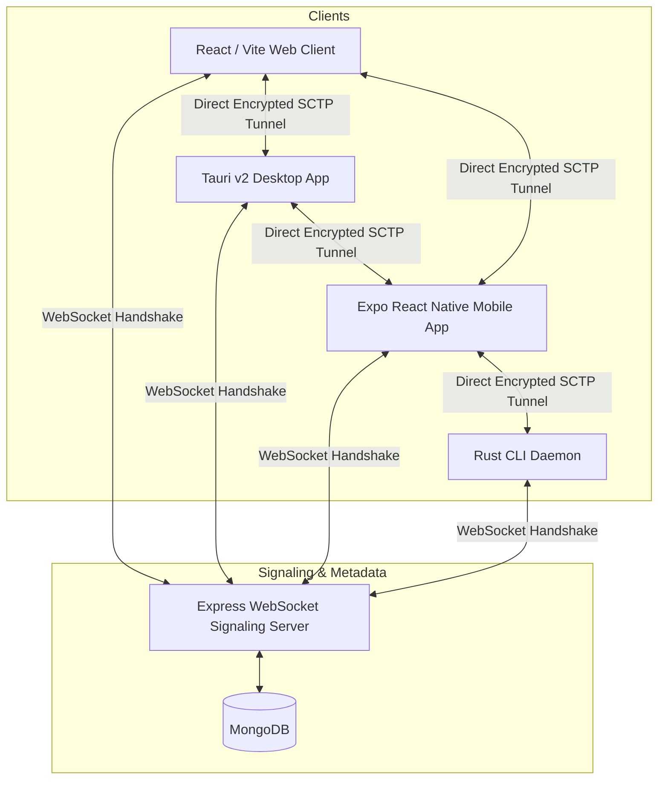

# 💧 OxiDrop

OxiDrop is a high-performance, secure, and completely open-source **peer-to-peer (P2P) file sharing system**. By leveraging WebRTC data channels, OxiDrop streams files directly between devices (browser-to-browser, desktop-to-mobile, CLI-to-CLI) without caching, storing, or routing file chunks through any intermediate cloud servers.

---

## 🏗️ Architecture & Protocol Flow

OxiDrop consists of four primary components working in unison:



### Protocol Stages:
1. **Metadata Registration (Phase 1)**: The sender registers file metadata (`fileName`, `sizeBytes`) on the signaling server via an HTTP POST request, obtaining a temporary 12-character hexadecimal **Share ID**.
2. **Access Request (Phase 2)**: The receiver enters the Share ID. The signaling server relays the request to the sender.
3. **WebRTC Signaling Handshake (Phase 3)**: Upon sender approval, the clients negotiate ICE candidates and exchange SDP Offers/Answers via WebSockets.
4. **Direct SCTP Tunneling (Phase 4)**: A secure peer-to-peer data channel is opened. The file is sliced, read, and streamed as raw binary bytes directly to the receiver, who streams/saves the chunks directly to disk.

---

## 🚀 Key Features

* **Zero Cloud Cache**: File payloads are streamed in real-time. The server only stores transient metadata and coordinates signaling.
* **Multi-Platform Support**:
  * **Web Client**: Simple browser interface built with React, Vite, and semantic CSS.
  * **Desktop Client**: Tauri v2 shell packaging the React app, featuring a sandboxed webview for minimal permission footprint.
  * **Mobile Client**: Expo & React Native app incorporating native WebRTC, documents selection, and system sharing sheets.
  * **CLI Client**: A CLI client written in pure Rust for command-line file shares and downloads.
* **Production-Grade Backend**: Rate limiting, strict size checks, automated WebSocket heartbeat (Ping-Pong) loop, structured JSON logging, and PM2 clustering.
* **Security Hardened**: Protected against directory traversal, XSS, resource leaks, and unauthorized access approvals.

---

## 📁 Repository Structure

```text
OxiDrop/
├── signaling-server/    # Node.js Express & WebSocket signaling node (MongoDB)
├── frontend/            # React + Vite web client & Tauri v2 desktop app configuration
│   └── src-tauri/       # Tauri v2 native Rust build parameters
├── mobile/              # Expo React Native mobile client (iOS & Android)
├── daemon/              # Rust-native command-line P2P client daemon
└── README.md            # Project documentation
```

---

## 🔧 Installation & Local Setup

### Prerequisites
* **Node.js** (v18+) & **npm**
* **Rust** (1.75+ for compile builds of Desktop and Daemon)
* **MongoDB** (Local instance or Atlas connection URI)

---

### 1. Signaling Server
Navigate to the directory, install dependencies, and configure the environment:

```bash
cd signaling-server
npm install
```

Create a `.env` file in the root of `/signaling-server`:
```env
PORT=5000
MONGODB_URI=mongodb://127.0.0.1:27017/oxidrop
NODE_ENV=development
```

Boot the server:
```bash
npm run dev
```

---

### 2. Web & Desktop Client (Tauri)
Navigate to the directory and install dependencies:

```bash
cd frontend
npm install
```

#### Run Web Client in Browser:
```bash
npm run dev
```

#### Run Desktop Client in Hot-Reload Development:
```bash
npm run tauri dev
```

#### Compile Desktop Distribution Installers (MSI / NSIS):
```bash
npm run tauri build
```
*Note: Generated installer packages are placed under `/src-tauri/target/release/bundle/`.*

---

### 3. Mobile Client (Expo React Native)
Navigate to the directory and install dependencies:

```bash
cd mobile
npm install
```

Start the Metro bundler:
```bash
npm run start
```
Use the **Expo Go** app on your iOS or Android device to scan the generated QR code. Configure your signaling server IP and Port in the top-right Settings drawer to connect.

---

### 4. Rust CLI Daemon
Navigate to the directory and compile the binary:

```bash
cd daemon
cargo build --release
```

#### Share a File:
```bash
./target/release/daemon send <FILE_PATH>
```

#### Receive a File (with auto-resume support):
```bash
./target/release/daemon receive <SHARE_ID> <OUTPUT_PATH>
```

---

## 🛡️ Security Disclosures & Hardening

* **Webview Sandboxing**: The Tauri desktop configuration enforces a zero-privilege policy. The app contains no filesystem (`tauri-plugin-fs`) or execution (`tauri-plugin-shell`) access. File transfers are executed entirely in the sandboxed Web API environment.
* **Content Security Policy (CSP)**: Built with a strict CSP that limits script execution and restricts connection handshakes exclusively to secure WebSocket (`ws:`, `wss:`) and API protocols.
* **Sanitized Filenames**: Prevents directory traversal attacks (`../` filename overrides) by stripping reserved operating system characters and enforcing relative folder containment before triggering downloads.
* **Memory Safety**: React Native and WebRTC connections are actively monitored for drops (`failed`/`disconnected` connection states) to instantly tear down inactive peer connections and avoid heap exhaustion.

---

## ☁️ Cloud Deployment

### Signaling Server
The server runs standard Express and persistent WebSockets. Deploy to platforms that support long-lived socket channels:
* **Docker Deployment**: A `Dockerfile` can be configured to run the server anywhere.
* **Render**: Deploy as a Web Service. Ensure you set the `MONGODB_URI` environment variable pointing to your **MongoDB Atlas** cluster.

### Web Client
The Vite build produces static bundles under `frontend/dist`. Deploy directly to **Vercel**, **Netlify**, or **GitHub Pages**.

---

## 📄 License

This project is open-source software licensed under the [MIT License](LICENSE).
