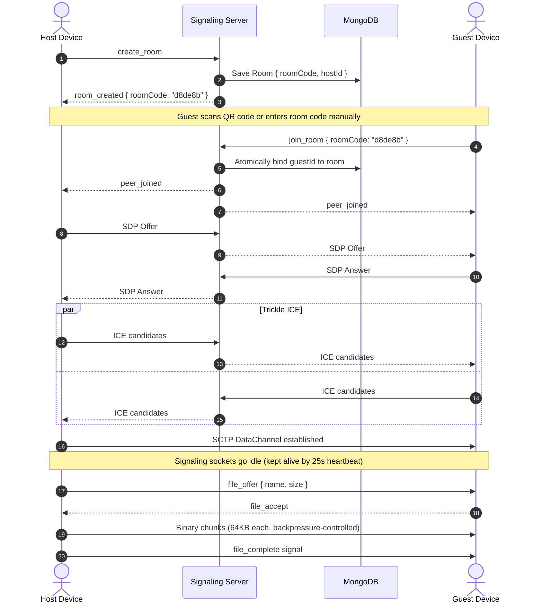
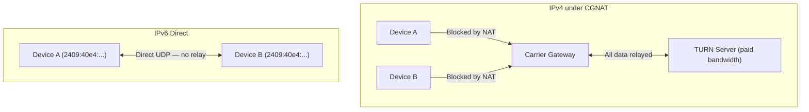

# 💧 OxiDrop

[](LICENSE)
[](https://nodejs.org/)
[](https://react.dev/)
[](https://v2.tauri.app/)
[](https://www.rust-lang.org/)
[](https://webrtc.org/)
[](https://www.mongodb.com/atlas)
[]()

OxiDrop is an open-source **peer-to-peer file sharing system** built on WebRTC data channels. Devices pair through a lightweight signaling server, then stream files directly between browsers — no cloud storage, no file routing through intermediate servers.

---

## 🏗️ Architecture & Protocol Flow

OxiDrop uses a **Connection-First Room Pairing** model. Devices establish a direct P2P tunnel first, then use it for file transfers and messaging. The signaling server only coordinates the initial handshake — all file data flows directly between peers.



### Protocol Stages

1. **Room Creation**: Host registers a room, receiving a 6-character hex room code and a rendered QR code.
2. **Device Pairing**: Guest enters the code or scans the QR code. The signaling server atomically binds the guest to the room.
3. **WebRTC Negotiation**: Host creates an `RTCPeerConnection`, generates an SDP Offer. The Offer, Answer, and Trickle ICE candidates are relayed through the signaling WebSocket.
4. **Direct SCTP Tunnel**: A peer-to-peer data channel opens. The signaling WebSocket drops to idle, kept alive by a 25-second application-layer heartbeat to prevent cloud proxy timeouts (Render, Heroku, etc.).
5. **File Transfer**: The sender transmits a metadata packet (`file_offer`). On acceptance, the file is sliced into 64KB chunks and streamed. The receiver writes chunks directly to disk via the File System Access API (with an in-memory buffer fallback for browsers that don't support it).

---

## 🌐 IPv6 CGNAT Bypass

The core technical contribution of OxiDrop is its approach to bypassing Carrier-Grade NAT (CGNAT) on mobile networks without relying on paid TURN relay servers.

### The Problem

Most mobile carriers (Jio, Airtel, and similar LTE/5G providers) use CGNAT to share a pool of IPv4 addresses across thousands of subscribers. Under CGNAT:
- Devices don't receive a public, routable IPv4 address
- Inbound connections are blocked at the carrier gateway
- WebRTC falls back to TURN relay servers, which route 100% of file data through a third party — making large transfers expensive and slow

### How OxiDrop Handles It

Modern 5G networks assign each device a unique, globally-routable **IPv6 address**. These addresses have no NAT layer — they're directly reachable. OxiDrop's WebRTC configuration includes dual-stack STUN servers, so the browser gathers both IPv4 and IPv6 ICE candidates. When both peers have public IPv6 addresses, the connection is established directly without any relay.



**This dramatically reduces TURN relay dependency** for users on IPv6-capable networks (which includes most modern 5G connections). It does not eliminate the need for TURN entirely — IPv4-only networks, enterprise firewalls, and ISPs without IPv6 support will still require relay fallback.

### Implementation Details

1. **ICE Candidate Queueing**: Mobile browsers mask local addresses behind `.local` mDNS hostnames for privacy. Since hotspot networks don't resolve mDNS, these candidates fail silently. OxiDrop queues all ICE candidates received before the remote description is set, then processes them in order once the SDP exchange completes. This gives STUN enough time to resolve the public IPv6 `srflx` candidates that actually work.

2. **Platform-Specific Firewall Behavior**:
   - **Android / iOS**: No configuration needed. Mobile OS firewalls don't block inbound UDP on cellular networks.
   - **macOS**: Works out of the box (macOS firewall is off by default).
   - **Windows (Web)**: Windows Defender Firewall blocks inbound UDP by default. Web browser users on Windows need to set their Wi-Fi profile to Private, or the connection will fall back to TURN. This is a known friction point — there's no way for a web app to modify firewall rules.
   - **Windows (Desktop App)**: The Tauri installer registers an inbound UDP firewall rule automatically during installation, so desktop users connect without manual configuration.

---

## ⚙️ Technical Details

### File Transfer: Chunking, Flow Control, and Large Files

| Parameter | Value |
|---|---|
| Chunk size | 64KB (`65536` bytes) |
| Backpressure threshold | 8MB (`bufferedAmount > 8 * 1024 * 1024`) |
| Backpressure delay | 15ms retry |
| Max theoretical file size | Limited only by browser memory / disk |

**Sender**: Files are sliced using `File.slice()` and read via `FileReader`. Each 64KB chunk is pushed to the DataChannel. If the channel's `bufferedAmount` exceeds 8MB, sending pauses for 15ms to let the buffer drain. This prevents overwhelming the SCTP layer and avoids data loss.

**Receiver**: If the browser supports the [File System Access API](https://developer.mozilla.org/en-US/docs/Web/API/File_System_Access_API) (`showSaveFilePicker`), chunks are written directly to disk as they arrive via a `FileSystemWritableFileStream`, with writes serialized through a promise queue. This means the receiver does **not** hold the full file in memory. For browsers without this API (Firefox, most mobile browsers), chunks accumulate in an in-memory `ArrayBuffer` array and are assembled into a `Blob` for download when the transfer completes. This means **large files (>1-2GB) may fail on memory-constrained devices** when the File System Access API is unavailable.

### Encryption

WebRTC DataChannels are encrypted at the transport layer using **DTLS** (Datagram Transport Layer Security). This means:
- All data in transit between peers is encrypted and authenticated
- A passive network observer cannot read the file contents
- The signaling server only sees SDP offers/answers and ICE candidates — never file data

**What this does not cover**: The signaling server can see room metadata (room codes, user IDs, SDP payloads). If the connection routes through a TURN relay, the relay server can theoretically observe encrypted DTLS traffic (though it cannot decrypt it without the session keys). OxiDrop does not implement application-layer end-to-end encryption on top of DTLS — the transport encryption provided by WebRTC is the only layer.

### Room Code Security

Room codes are 6-character hexadecimal strings (~16.7 million combinations). To prevent brute-force enumeration:
- **Rate limiting**: Room creation is limited to 50 requests per IP per 15-minute window. All API routes are limited to 200 requests per IP per 15-minute window (enforced by `express-rate-limit`).
- **TTL expiry**: Rooms auto-expire after 1 hour via a MongoDB TTL index on `createdAt`. The window of vulnerability for code guessing is limited to the room's active lifetime, which is typically under 5 minutes for a successful pairing.
- **Single occupancy**: Each room accepts exactly one guest. Once paired, the room code cannot be reused by another device.

> [!NOTE]
> For higher-security deployments, the room code length and character set can be increased. The current 6-char hex format is a usability tradeoff — short codes are easier to type on mobile devices.

### TURN Relay Fallback (Metered.ca)

When direct P2P connections fail (IPv4-only networks, symmetric NAT, corporate firewalls), OxiDrop falls back to TURN relay servers provided by [Metered.ca](https://www.metered.ca/):

- **Credential rotation**: The signaling server fetches fresh TURN credentials from the Metered.ca API (`/api/v1/turn/credentials`) on every client connection via the `/api/webrtc/ice-servers` endpoint. Credentials are short-lived and rotated by Metered.ca automatically.
- **Ports**: Metered.ca TURN servers listen on ports `80` and `443` (TCP/TLS), which helps bypass restrictive corporate firewalls that block non-standard UDP ports.
- **Free tier limits**: Metered.ca's free tier provides 50GB/month of TURN relay bandwidth. Beyond this, connections that require relay will fail. The IPv6-first approach minimizes relay usage, but TURN is not unlimited.
- **Fallback configuration**: If no `METERED_API_KEY` is set, the server can fall back to a manually configured TURN server via `TURN_URL`, `TURN_USERNAME`, and `TURN_CREDENTIAL` environment variables. If neither is configured, only STUN is available and connections behind symmetric NAT will fail.

### Self-Healing Reconnection

Mobile networks frequently drop WebSocket connections during screen locks, app switches, or cellular handovers. When the client reconnects:
1. The signaling server queries MongoDB for the user's existing active room
2. If a paired room is found, the server re-emits `peer_joined` events to both peers
3. Both clients tear down stale `RTCPeerConnection` objects and re-negotiate a fresh WebRTC handshake

This recovers from transient network drops without requiring users to re-enter room codes.

### WebSocket Keepalive

Cloud reverse proxies (Render, Heroku, Cloudflare) terminate idle WebSocket connections after 30-60 seconds of inactivity. OxiDrop uses an application-layer heartbeat: the client sends `{ type: "ping" }` every 25 seconds, and the server replies with `{ type: "pong" }`. This is separate from the WebSocket protocol-level ping/pong (which proxies ignore) and ensures the connection survives indefinitely.

---

## 📁 Repository Structure

```text
OxiDrop/
├── signaling-server/       # Node.js signaling server (Express, WebSocket, MongoDB)
│   └── src/
│       ├── models/          # Mongoose schemas (Room)
│       ├── middleware/       # Error handler, async wrapper
│       ├── routes.js        # REST API: health check, ICE servers, room CRUD
│       ├── socket.js        # WebSocket event handlers, reconnect sync, heartbeat
│       └── config.js        # Port, message size limits
├── frontend/                # React + Vite web client
│   ├── src-tauri/           # Tauri v2 desktop app configuration (Rust)
│   └── src/
│       ├── components/      # UI panels, QR scanner, developer console
│       ├── hooks/           # useOxiDrop — WebRTC logic, ICE queue, file streaming
│       └── utils/           # QR generation, filename sanitization
├── mobile/                  # Expo React Native app (iOS & Android)
├── daemon/                  # Rust CLI client
└── README.md
```

---

## 🔧 Installation & Local Setup

### Prerequisites
- **Node.js** v18+ and **npm**
- **Rust** 1.75+ (for Desktop and CLI builds)
- **MongoDB** (local instance or Atlas URI)

### 1. Signaling Server

```bash
cd signaling-server
npm install
```

Create `.env`:
```env
PORT=5000
MONGODB_URI=mongodb://127.0.0.1:27017/oxidrop
METERED_API_KEY=your_metered_api_key    # Optional: enables TURN fallback
NODE_ENV=development
```

```bash
npm run dev
```

### 2. Web Client

```bash
cd frontend
npm install
npm run dev -- --host    # --host exposes on LAN for mobile testing
```

### 3. Desktop Client (Tauri)

```bash
cd frontend
npm run tauri dev        # Hot-reload development
npm run tauri build      # Compile MSI/NSIS installer → src-tauri/target/release/bundle/
```

### 4. Mobile Client (Expo)

```bash
cd mobile
npm install
npm run start            # Scan the Metro QR with Expo Go
```

### 5. Rust CLI Daemon

```bash
cd daemon
cargo build --release
./target/release/daemon send <FILE_PATH>
./target/release/daemon receive <SHARE_ID> <OUTPUT_PATH>
```

---

## 🛡️ Security

- **Transport Encryption**: All peer data is encrypted via DTLS (provided by WebRTC). The signaling server never sees file contents.
- **Webview Sandboxing**: The Tauri desktop app has zero filesystem and shell plugin access. File I/O is handled entirely through browser APIs inside the sandboxed webview.
- **Content Security Policy**: Strict CSP restricts script sources and limits connections to WebSocket and API origins only.
- **Filename Sanitization**: Reserved OS characters (`<>:"/\|?*`) and control characters (`\x00-\x1F`) are stripped from received filenames to prevent directory traversal attacks.
- **Connection Teardown**: WebRTC connections are monitored for `failed` and `disconnected` states. Stale connections are torn down to prevent resource leaks.
- **Rate Limiting**: All API routes enforce per-IP rate limits via `express-rate-limit`. Room creation has a stricter limit (50/15min) to prevent database flooding.

---


## Known Limitations

- **Large files on Firefox/mobile browsers**: Browsers without the File System Access API buffer received files in memory. Transfers over ~1-2GB may fail on memory-constrained devices.
- **Windows web users**: Windows Defender Firewall blocks inbound UDP by default. Web users behind this firewall will fall back to TURN relay unless they manually adjust their network profile. The Tauri desktop app handles this automatically.
- **IPv4-only networks**: The IPv6 CGNAT bypass only helps on networks that assign public IPv6 addresses. IPv4-only connections still require TURN.
- **MongoDB for ephemeral data**: Rooms are short-lived key-value pairs. Redis would be a better fit for this workload (in-memory, native TTL, sub-millisecond reads). MongoDB was chosen because Atlas provides a free-forever tier suitable for zero-cost deployment, but a production migration to Redis is recommended for high-traffic deployments.
- **TURN bandwidth cap**: Metered.ca's free tier allows 50GB/month of relay bandwidth. High-volume usage will exhaust this.

---

## 📄 License

This project is open-source software licensed under the [MIT License](LICENSE).
